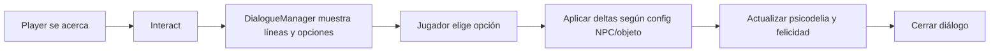

# GAMEPLAY

Documento de referencia del gameplay del juego. Está pensado para **desarrolladores** y **agentes de IA**: cualquier agente que extienda o modifique el juego debe usar este archivo como contexto para entender el diseño objetivo y la base de código existente.

---

## 1. Propósito del documento

- Describir el **gameplay objetivo**: interacción con NPCs/objetos, diálogos con opciones y consecuencias en psicodelia y felicidad, efectos visuales (cámara psicodélica, cara del personaje).
- Mapear **qué existe ya** en el código y **qué falta** por implementar.
- Ser lo bastante **específico** para que un agente de IA entienda el diseño y extienda el juego sin ambigüedades.

---

## 2. Gameplay en una página

### Loop principal

El jugador se mueve por el mundo, se acerca a **NPCs** u **objetos interactuables**, pulsa **Interact** y se abre un **diálogo**: texto tipo typewriter y, al final, **opciones de respuesta**. Según la opción elegida y la **configuración del NPC/objeto**, el juego actualiza dos estadísticas del personaje:

- **Nivel de psicodelia**
- **Nivel de felicidad**

### Estado global: GameController

**GameController** (`Assets/scripts/GameController.cs`) es la **fuente de verdad** del estado de psicodelia y felicidad del personaje. Lleva los niveles (p. ej. `PsychedeliaLevel` y `HappinessLevel`) y otros sistemas **leen** de GameController para aplicar ese estado:

- **Efecto de cámara:** PsychedelicCameraEffect lee el nivel de psicodelia de GameController y aplica esa intensidad al shader/post-proceso.
- **Cara Doom:** El componente de la cara del personaje lee el nivel de felicidad de GameController y muestra la expresión o frame correspondiente.

Así, el diálogo (y cualquier otro sistema) solo actualiza los valores en GameController; la cámara y la cara reaccionan leyendo ese estado.

### Psicodelia

Valor numérico (p. ej. 0–1 o 0–100) que GameController mantiene y que controla la **intensidad de un efecto visual en pantalla completa** (shader/post-proceso en cámara). El efecto de cámara (PsychedelicCameraEffect) **lee** el nivel de psicodelia de GameController y aplica esa intensidad. A mayor nivel, más “psicodélico” se ve **todo el juego**.

### Felicidad

Valor numérico que GameController mantiene y que se refleja en la **cara del personaje** mostrada en pantalla: UI fija en la parte **inferior central** (estilo Doom). El componente de la cara **lee** el nivel de felicidad de GameController y muestra la expresión o frame correspondiente. No es un HUD genérico; es la **cara del protagonista** (p. ej. rangos: muy bajo = triste, medio = neutro, alto = feliz).

---

## 3. Diagrama de flujo

---

## 4. Sistemas detallados

### 4.1 Interacción: NPCs y objetos

- **Quién puede dar diálogo:** NPCs (ya soportados) y **objetos** (objetivo futuro: mismos datos de diálogo + opciones + configuración de consecuencias).
- **Datos por NPC/objeto:**
  - Texto del diálogo (líneas).
  - Opciones de respuesta (lista de strings).
  - **Configuración por opción:** Para cada opción (índice 0, 1, 2…), definir:
    - **Delta de psicodelia** (aumentar o disminuir; ej. +0.2, -0.1).
    - **Delta de felicidad** (aumentar o disminuir; ej. +10, -5).
  - Opcional: nombre del hablante (para NPCs; objetos pueden usar un nombre o “Objeto”).

**Base actual:** `Assets/scripts/NpcController.cs` tiene `speakerName`, `dialogueText`, `dialogueChoices` y un único `choiceIndexThatTriggersEffect` que hoy solo sube psicodelia para una opción. Falta: configuración por opción con deltas de psicodelia y felicidad (subir/bajar ambos).

### 4.2 Flujo de diálogo

- **Existente:** `Assets/scripts/DialogueManager.cs` — `StartDialogue(speaker, lines, choices, owner)`, typewriter, navegación de opciones (UI/joystick), `Advance()` al confirmar. Al elegir opción: si `dialogueOwner.ChoiceIndexThatTriggersEffect == choiceSelectedIndex` llama a `PsychedelicCameraEffect.Instance.AddIntensity(0.2f)` y guarda `GameController.Instance.LastDialogueResponse`.
- **Objetivo:** En lugar de un solo “índice que activa efecto”, cada opción debe tener **deltas configurables** (psicodelia y felicidad). Al confirmar opción, el juego aplica esos deltas a los niveles globales y la cámara/cara se actualizan según esos niveles.

### 4.3 GameController: estado de psicodelia y felicidad

GameController debe **llevar** el estado de psicodelia y felicidad (p. ej. `PsychedeliaLevel`, `HappinessLevel`) y exponerlo para que otros sistemas lo lean. El efecto de cámara y la cara Doom **no** mantienen su propio estado; **aplican** el estado que leen de GameController. Así, al confirmar una opción de diálogo, DialogueManager (u otro sistema) actualiza solo GameController; PsychedelicCameraEffect y el componente de la cara reaccionan en sus `Update`/`LateUpdate` leyendo esos valores.

### 4.4 Nivel de psicodelia y efecto de cámara

- **Existente:** `Assets/scripts/PsychedelicCameraEffect.cs` — Singleton en la cámara, `intensity` 0–1, `AddIntensity(amount)`, decay opcional, shader `Hidden/PsychedelicEffect` en `OnRenderImage`.
- **Objetivo:** La intensidad del efecto debe derivar del **nivel de psicodelia en GameController**. PsychedelicCameraEffect lee `GameController.Instance.PsychedeliaLevel` (o equivalente) y aplica ese valor al shader. Las elecciones de diálogo modifican el nivel en GameController; la cámara siempre refleja ese nivel.

### 4.5 Felicidad y cara del personaje (estilo Doom)

- **Objetivo:** Una UI fija en la parte **inferior central** que muestra la **cara del personaje** (sprite/animación). El componente de la cara **lee** el nivel de felicidad de GameController y elige la expresión o frame (p. ej. muy bajo = triste, medio = neutro, alto = feliz).
- **No existe aún:** No hay componente de “face UI”. Especificación: posición (abajo centro), cara del protagonista; el valor de felicidad lo lleva GameController y el componente de la cara solo lo lee para mostrar el frame correcto.

---

## 5. Estado actual del código

| Concepto | Archivo / componente | Estado |
|----------|----------------------|--------|
| Diálogo con opciones | DialogueManager, DialogueUI, CreateDialogueUI | Hecho (falta vincular deltas por opción) |
| NPC que inicia diálogo | NpcController (trigger 2D, StartDialogue) | Hecho (falta config de deltas por opción) |
| Interact | PlayerController (Interact, radio, NPC más cercano) | Hecho |
| Efecto psicodélico cámara | PsychedelicCameraEffect (lee nivel de GameController) | Hecho (falta que lea PsychedeliaLevel de GameController) |
| Respuesta última | GameController.LastDialogueResponse | Hecho |
| Nivel psicodelia (estado global) | GameController (PsychedeliaLevel) | Por implementar; efecto cámara lee de aquí |
| Nivel felicidad (estado global) | GameController (HappinessLevel) | Por implementar; cara Doom lee de aquí |
| Cara personaje (Doom) | — | Por implementar |
| Objetos interactuables | — | Por implementar (mismo contrato que NPC: diálogo + opciones + deltas) |

---

## 6. Especificaciones para agentes IA

- **Ubicación de datos de diálogo:** NpcController en el inspector (y en el futuro, un componente equivalente en objetos). Extensión: por cada opción, dos valores numéricos (delta psicodelia, delta felicidad).
- **Dónde persistir niveles:** **GameController** lleva el estado con `PsychedeliaLevel` y `HappinessLevel`. PsychedelicCameraEffect lee el nivel de psicodelia de GameController y aplica esa intensidad al efecto de cámara; el componente de la cara Doom lee el nivel de felicidad de GameController y aplica la expresión/frame correspondiente.
- **Contrato de DialogueManager al confirmar opción:** Recibir el índice elegido y el `owner` (NpcController u objeto); el owner proporciona los deltas para ese índice; el juego aplica los deltas y actualiza UI/cámara.
- **Input:** Se usa Input System con action maps `"Player"` y `"UI"`; durante el diálogo el movimiento está deshabilitado y la navegación de opciones usa `"UI/Navigate"`.
